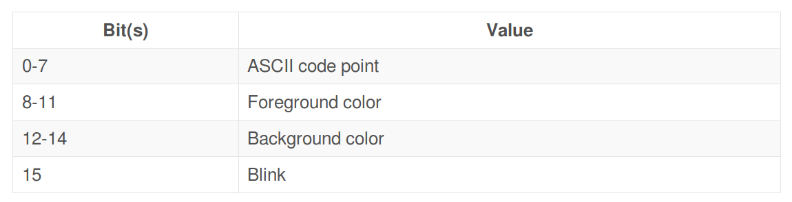
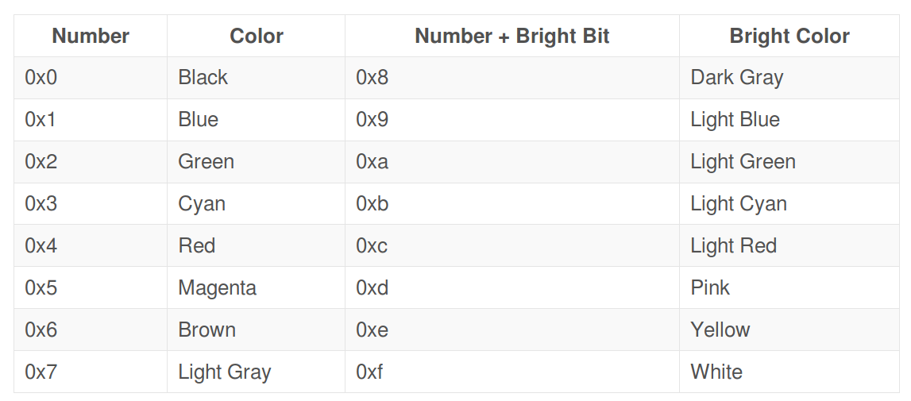
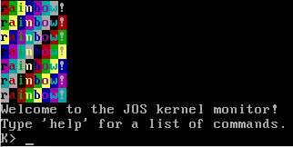
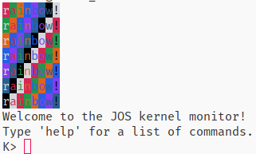

# JOS Lab1 Report

陈仁泽 1700012774

[TOC]

## Exercise 1
---
## Exercise 2

跳转到bootloader前的指令：
```
[f000:fff0]    0xffff0:	ljmp   $0xf000,$0xe05b
0x0000fff0 in ?? ()
(gdb) si
[f000:e05b]    0xfe05b:	cmpl   $0x0,%cs:0x70c8
0x0000e05b in ?? ()
(gdb) si
[f000:e062]    0xfe062:	jne    0xfd414
0x0000e062 in ?? ()
(gdb) si
[f000:e066]    0xfe066:	xor    %dx,%dx
0x0000e066 in ?? ()
(gdb) si
[f000:e068]    0xfe068:	mov    %dx,%ss
0x0000e068 in ?? ()
(gdb) si
[f000:e06a]    0xfe06a:	mov    $0x7000,%esp
0x0000e06a in ?? ()
(gdb) si
[f000:e070]    0xfe070:	mov    $0xf2d4e,%edx
0x0000e070 in ?? ()
(gdb) si
[f000:e076]    0xfe076:	jmp    0xfff00
0x0000e076 in ?? ()
```
在ROM上进行一些初始化工作，如：检查RAM，初始化硬件，初始化段寄存器ss和栈指针esp等。之后跳转到bootloader，即RAM地址0x7c00处（和GDB显示的不一致）

---
## Exercise 3

> Q1: At what point does the processor start executing 32-bit code? What exactly causes the switch from 16- to 32-bit mode?

在执行了`ljmp    $PROT_MODE_CSEG, $protcseg`后，处理器跳转到32位代码。

在以下代码执行，使能了A20总线后，处理器从16位模式进入32位模式。
```
seta20.1:
    inb     $0x64,%al               # Wait for not busy
    testb   $0x2,%al
    jnz     seta20.1

    movb    $0xd1,%al               # 0xd1 -> port 0x64
    outb    %al,$0x64

seta20.2:
    inb     $0x64,%al               # Wait for not busy
    testb   $0x2,%al
    jnz     seta20.2

    movb    $0xdf,%al               # 0xdf -> port 0x60
    outb    %al,$0x60
```
<br/>

> Q2: What is the last instruction of the boot loader executed, and what is the first instruction of the kernel it just loaded?

bootloader最后执行的语句及其对应的指令为:
```
((void (*)(void)) (ELFHDR->e_entry))();
  7d6b:	ff 15 18 00 01 00    	call   *0x10018
```

kernel被加载进来时执行的第一个指令为:
```
movw	$0x1234,0x472			# warm boot
```
<br/>

> Q3: Where is the first instruction of the kernel?

内核执行的第一条指令位于`0x10000c`

<br/>

> Q4: How does the boot loader decide how many sectors it must read in order to fetch the entire kernel from disk? Where does it find this information?

1. 根据elf文件结构体的`e_phoff`字段确定第一个程序段头（program segment header）的偏移
2. 根据`e_phnum`字段确定程序段头的数量
3. 依次读入各个程序段头：根据其结构体的`p_memsz`获取对应程序段（program segment）所占的大小，再据此算出该读入多少扇区（sector）

---
## Exercise 4

---
## Exercise 5

> Q: Identify the first instruction that would "break" or otherwise do the wrong thing if you were to get the boot loader's link address wrong.

会引起错误的第一条指令为
```
ljmp    $PROT_MODE_CSEG, $protcseg
```
因为`protcseg`不是位置无关代码（position indepandent code）。该地址在链接时确定，但是BIOS将bootloader加载到的地址却是固定的（0x7c00）。因此若改变了链接地址，会导致该指令跳转到错误的位置。

当然，事实上之前的`lgdt　gdtdesc`指令也会加载错误位置的`GDT`，但是影响并没有`ljmp`这样快而直接。

---
## Exercise 6

> Q: Examine the 8 words of memory at 0x00100000 at the point the BIOS enters the boot loader, and then again at the point the boot loader enters the kernel. Why are they different? What is there at the second breakpoint?

在刚进入bootloader时，那些内存位置均为0

进入kernel时，内存数据如下：

```
(gdb) x/8x 0x100000
0x100000:	0x1badb002	0x00000000	0xe4524ffe	0x7205c766
0x100010:	0x34000004	0x2000b812	0x220f0011	0xc0200fd8
```
这些数据为bootloader所加载的.text段的开头：
```
// entry.S
.text
.align 4
.long MULTIBOOT_HEADER_MAGIC
.long MULTIBOOT_HEADER_FLAGS
.long CHECKSUM
.globl		_start
_start = RELOC(entry)
.globl entry
entry:
	movw	$0x1234,0x472
	movl	$(RELOC(entry_pgdir)), %eax
	movl	%eax, %cr3
	movl	%cr0, %eax
    ...
```
```
// kernel.asm
.globl entry
entry:
f0100000:	02 b0 ad 1b 00 00    	add    0x1bad(%eax),%dh
f0100006:	00 00                	add    %al,(%eax)
f0100008:	fe 4f 52             	decb   0x52(%edi)
f010000b:	e4                   	.byte 0xe4
f010000c <entry>:
f010000c:	66 c7 05 72 04 00 00 	movw   $0x1234,0x472
f0100013:	34 12 
f0100015:	b8 00 20 11 00       	mov    $0x112000,%eax
f010001a:	0f 22 d8             	mov    %eax,%cr3
f010001d:	0f 20 c0             	mov    %cr0,%eax
f0100020:	......
```

---
## Exercise 7

> Q: What is the first instruction after the new mapping is established that would fail to work properly if the mapping weren't in place?

初次出问题的指令：
```
jmp	*%eax
```
此时`%eax`储存的为`0xf010002f`，若初始使用的页表没有合理映射，可能会使跳转出问题。

---
## Exercise 8

> We have omitted a small fragment of code - the code necessary to print octal numbers using patterns of the form "%o". Find and fill in this code fragment.

修改`printfmt.c`中的`vprintfmt`函数：
```C
// (unsigned) octal
case 'o':
    // Replace this with your code.
    num = getuint(&ap, lflag);
    base = 8;
    goto number;
```

<br/>

> Q1: Explain the interface between printf.c and console.c. Specifically, what function does console.c export? How is this function used by printf.c?

`console.c`导出`cputchar`函数供`printf.c`中的`putch`函数使用：
```C
// printf.c
static void
putch(int ch, int *cnt)
{
	cputchar(ch); // from console.c
	*cnt++;
}
```
`printf.c`中的`putch`作为参数传入`printfmt.c`中的`vprintfmt`函数

<br/>

> Q2: Explain the following from console.c:
```C
1 if (crt_pos >= CRT_SIZE) {
2   int i;
3   memmove(crt_buf, crt_buf + CRT_COLS, (CRT_SIZE - CRT_COLS) * sizeof(uint16_t));
4   for (i = CRT_SIZE - CRT_COLS; i < CRT_SIZE; i++)
5       crt_buf[i] = 0x0700 | ' ';
6   crt_pos -= CRT_COLS;
7 }
```
改段代码用于滚屏，也就是当当前输出位置`crt_pos`大于屏幕容量的时候，不断将屏幕上移（每次上移一行）并更新`crt_pos`，直到`crt_pos`位于屏幕内。

<br/>

> Q3: Answer the following questions: 

```C
int x = 1, y = 3, z = 4;
cprintf("x %d, y %x, z %d\n", x, y, z);
```
<br/>

> Q3.1: In the call to cprintf(), to what does fmt point? To what does ap point?

`fmt`指向字符串`"x %d, y %x, z %d\n"`，也即`8(%ebp)`位置处的第一个参数。`ap`指向可变参数列表，也即`12(%ebp)`位置处的第二个参数

<br/>

> Q3.2: List (in order of execution) each call to cons_putc, va_arg, and vcprintf. For cons_putc, list its argument as well. For va_arg, list what ap points to before and after the call. For vcprintf list the values of its two arguments.

```C
vcprintf("x %d, y %x, z %d\n", va_list{x, y, z})
cons_putc('x')
cons_putc(' ')
va_arg, ap: va_list{x, y, z} => va_list{y, z}
cons_putc('1')
cons_putc(',')
cons_putc(' ')
cons_putc('y')
cons_putc(' ')
va_arg, ap: va_list{y, z} => va_list{z}
cons_putc('3')
cons_putc(',')
cons_putc(' ')
cons_putc('z')
cons_putc(' ')
va_arg, ap: va_list{z} => va_list{}
cons_putc('4')
cons_putc('4')
cons_putc('\n')
```

<br/>

> Q4: What is the output? Explain how this output is arrived at in the step-by-step manner of the previous exercise. Here's an ASCII table that maps bytes to characters.
> 
> The output depends on that fact that the x86 is little-endian. If the x86 were instead big-endian what would you set i to in order to yield the same output? Would you need to change 57616 to a different value?

    unsigned int i = 0x00646c72;
    cprintf("H%x Wo%s", 57616, &i);

输出为`He110 World`

57616的16进制表示为110，而十六进制数72,6c,64在ASCII码中对应的字符分别为r, l, d

若为大端法，则只需令`i = 0x726c6400`，无需改动57616

<br/>

> Q5: In the following code, what is going to be printed after 'y='? (note: the answer is not a specific value.) Why does this happen?

```C
cprintf("x=%d y=%d", 3);
```
将会输出`12(%ebp)`处的值

<br/>

> Q6: Let's say that GCC changed its calling convention so that it pushed arguments on the stack in declaration order, so that the last argument is pushed last. How would you have to change cprintf or its interface so that it would still be possible to pass it a variable number of arguments?

将其接口改为
```C
cprintf(..., int n, const char* fmt)
```
其中`n`可变参数的个数。

或者
```C
cprintf(..., const char* fmt)
```
其中可变参数倒序输入。

如果可变参数正序输入但是又没有输入其个数的话，会给后续的处理带来不必要的麻烦（可能需要至少两趟对`fmt`的遍历）

---
## Exercise 9

> Q: Determine where the kernel initializes its stack, and exactly where in memory its stack is located. How does the kernel reserve space for its stack? And at which "end" of this reserved area is the stack pointer initialized to point to?

初始化栈指针的指令为：
```
// entry.S
movl	$(bootstacktop),%esp
```
初始的栈所在位置为一个.data段：
```
// entry.S
.data
	.p2align	PGSHIFT
	.globl		bootstack
bootstack:
	.space		KSTKSIZE
	.globl		bootstacktop   
bootstacktop:
```
如上述代码，采用`.space KSTKSIZE`为栈静态分配空间

栈指针初始指向`bootstacktop`，即该栈空间的地址最高处

---
## Exercise 10

> Q: How many 32-bit words does each recursive nesting level of test_backtrace push on the stack, and what are those words?

递归调用自身时，`test_backtrace`先将`x-1`压栈，再将返回地址压栈，再将`%ebp`压栈，共3个32位数。

---
## Exercise 11-12

在`commands`中插入：
```C
{"backtrace", "Backtrace the call of functions", mon_backtrace},
```
在`monitor`添加函数：
```C

int
mon_backtrace(int argc, char **argv, struct Trapframe *tf)
{
	// Your code here.
    uint32_t ebp, eip, arg;
    struct Eipdebuginfo info;

    cprintf("Stack backtrace:\n");

	// backtrace the ebp chain
    for(ebp = read_ebp(); ebp != 0; ebp = *(uint32_t*)(ebp)) {
        cprintf("  ebp %08x", ebp);
        eip = *((uint32_t*)ebp + 1);
        cprintf("  eip %08x", eip);
        cprintf("  args");
        for(int i=0; i<5; ++i) {
            arg = *((uint32_t*)ebp + 2 + i);
            cprintf(" %08x", arg);
        }
        cprintf("\n");

		// get eip info
        debuginfo_eip(eip, &info);
        cprintf("         %s:%d: %.*s+%u\n", 
            info.eip_file, 
            info.eip_line, 
            info.eip_fn_namelen, info.eip_fn_name, 
            eip - info.eip_fn_addr);
    }
	return 0;
}
```

在`debuginfo_eip`函数中插入：

```C
// Your code here.
stab_binsearch(stabs, &lline, &rline, N_SLINE, addr);
if (lline > rline)
    return -1;
info->eip_line = stabs[lline].n_desc;
```


## This completes the lab-1

```
running JOS: (0.7s) 
  printf: OK 
  backtrace count: OK 
  backtrace arguments: OK 
  backtrace symbols: OK 
  backtrace lines: OK 
Score: 50/50
```

## Challenge

采用ANSI ESC Sequence嵌入来实现彩色字体的显示，如：

```C
"Hello World" => "\033[<Param1>;<Param2>;...mHello World\033[0m"
```

其中`<ParamN>`为参数，其中决定颜色的参数为：（参见 http://rrbrandt.dee.ufcg.edu.br/en/docs/ansi/ ）

| 颜色 | 前景 | 背景 |
|-----|---------|---------|
|Black   |30       |40       |
|Red   |31       |41       |
|Green   |32       |42       |
|Yellow   |33       |43       |
|Blue   |34       |44       |
|Magenta   |35       |45       |
|Cyan   |36       |46       |
|White (Light gray)   |37       |47       |

`cga_putc`函数（打印到Qemu的console）暂时不会处理ANSI Escape Sequence，而`serial_putc`函数（打印到用户Terminal）会处理。这就导致了两者的打印内容的差异。因此要先修改`cga_putc`以改变VGA的输出行为。

在VGA的text-mode下，buffer中填充的数据的位域构成如下（参见 https://os.phil-opp.com/vga-text-mode/ ）：



其中color部分数值对应的颜色为：



因此修改`console.c`的`cga_putc`函数：

```C

// Old cga_putc
static void
cga_putc1(int c)
{
	// if no attribute given, then use black on white
	if (!(c & ~0xFF))
		c |= 0x0700;

	switch (c & 0xff) {
	case '\b':
		if (crt_pos > 0) {
			crt_pos--;
			crt_buf[crt_pos] = (c & ~0xff) | ' ';
		}
		break;
	case '\n':
		crt_pos += CRT_COLS;
		/* fallthru */
	case '\r':
		crt_pos -= (crt_pos % CRT_COLS);
		break;
	case '\t':
		cons_putc(' ');
		cons_putc(' ');
		cons_putc(' ');
		cons_putc(' ');
		cons_putc(' ');
		break;
	default:
		crt_buf[crt_pos++] = c;		/* write the character */
		break;
	}

	// What is the purpose of this?
	if (crt_pos >= CRT_SIZE) {
		int i;

		memmove(crt_buf, crt_buf + CRT_COLS, (CRT_SIZE - CRT_COLS) * sizeof(uint16_t));
		for (i = CRT_SIZE - CRT_COLS; i < CRT_SIZE; i++)
			crt_buf[i] = 0x0700 | ' ';
		crt_pos -= CRT_COLS;
	}

	/* move that little blinky thing */
	/* just move the cursor */
	outb(addr_6845, 14);
	outb(addr_6845 + 1, crt_pos >> 8);
	outb(addr_6845, 15);
	outb(addr_6845 + 1, crt_pos);
}

static int
isdigit(int c)
{
	return c >= '0' && c <= '9';
}

static int 
atoi(const char* s)
{
	int res = 0;
	for (int i = 0; isdigit(s[i]); ++i)
		res = res * 10 + (s[i] - '0');
	return res;
}

// Modify the VGA text-mode character attribute 'attr' 
// based on the parameter contained in the buf.
static void
handle_ansi_esc_param(const char* buf, int len, int* attr)
{
	// white is light grey
	static int ansi2cga[] = {0x0, 0x4, 0x2, 0xe, 0x1, 0x5, 0x3, 0x7};
	int tmp_attr = *attr;
	int n = atoi(buf);
	if (n >= 30 && n <= 37) {
		tmp_attr = (tmp_attr & ~(0x0f)) | ansi2cga[n - 30];
	} else if (n >= 40 && n <= 47) {
		tmp_attr = (tmp_attr & ~(0xf0)) | (ansi2cga[n - 40] << 4);
	} else if (n == 0) {
		tmp_attr = 0x07;
	}
	*attr = tmp_attr;
}

// The max length of one parameter.
// Emmmmmm... no body will input 
// a number parameter with length of 1023, probably.
#define ESC_BUFSZ 1024

// If the character is '\033' (esc), then buffer the input
// until get a whole ANSI Esc Seq (and update the attribute) 
// or get a false input midway.
// Otherwise output it normally.
// 
// Use a deterministic finite automata:
// 
// [0]: '\033'	=> [1]
// 		other	=> [0] + output the character
// 
// [1]: '\033'	=> [1]
// 		'['		=> [2]
// 		other	=> [0]
// 
// [2]: digit	=> [3] + begin record the modification
// 		other	=> [0] + discard the modification
// 
// [3]: digit	=> [3]
// 		';'		=> [2] + record the modification of attribute
// 		'm'		=> [0] + update the attribute
// 		other 	=> [0] + discard the modification
// 
static void 
cga_putc(int c)
{
	static int state = 0;
	static char esc_buf[ESC_BUFSZ];
	static int esc_len = 0;
	static int attr = 0; // default attribute.
	static int esc_attr = 0;

	switch(state) {
	case 0: {
		if ((char)c == '\033') {
			state = 1;
		} else {
			cga_putc1((attr << 8) | (c & 0xff));
		}
		break;
	}
	case 1: {
		if ((char)c == '[') {
			esc_attr = attr;
			state = 2;
		} else if ((char)c != '\033') {
			state = 0;
		}
		break;
	}
	case 2: {
		if (isdigit(c)) {
			esc_buf[esc_len++] = (char)c;
			state = 3;
		} else {
			// discard modification
			esc_len = 0;

			state = 0;
		}
		break;
	}
	case 3: {
		if (isdigit(c)) {
			esc_buf[esc_len++] = (char)c;
		} else if ((char)c == ';') {
			// record current modification
			esc_buf[esc_len++] = 0;
			handle_ansi_esc_param(esc_buf, esc_len, &esc_attr);
			esc_len = 0;

			state = 2;
		} else if ((char)c == 'm') {
			// update the attribute
			esc_buf[esc_len++] = 0;
			handle_ansi_esc_param(esc_buf, esc_len, &esc_attr);
			esc_len = 0;
			attr = esc_attr;

			state = 0;
		} else {
			// discard modification
			esc_len = 0;

			state = 0;
		}
		break;
	}
	}
}


```

这样VGA就支持ANSI Escape Sequence了。除了只会接受数字参数（最长为1023，虽然并没有这么长的数字参数……），只会处理颜色参数（前景色、背景色）和重置参数之外，其余行为与bash的行为一致，如后出现的参数会覆盖之前出现的与其不相容的参数（例如后出现的前景色会覆盖前出现的前景色）等。

为了方便设置颜色，在`stdio.h`中加入颜色设置接口：

```C

// color enum
enum {
    COLOR_BLACK = 0,
    COLOR_RED,
    COLOR_GREEN,
    COLOR_YELLOW,
    COLOR_BLUE,
    COLOR_MAGENTA,
    COLOR_CYAN,
    COLOR_WHITE,
    COLOR_NUM,
};

// set and reset the foreground color
void set_fgcolor(int color);
void reset_fgcolor();

// set and reset the background color
void set_bgcolor(int color);
void reset_bgcolor();

```
在`printf.c`中实现接口：
```C

static int fgclr = -1;
static int bgclr = -1;
static const char numbers[] = "0123456789";

void 
set_fgcolor(int clr) 
{
	fgclr = clr;
	cprintf("\033[3%cm", numbers[clr]);
}

void
set_bgcolor(int clr)
{
	bgclr = clr;
	cprintf("\033[4%cm", numbers[clr]);
}

void 
reset_fgcolor()
{
	cprintf("\033[0m");
	if (bgclr != -1)
		cprintf("\033[4%cm", numbers[bgclr]);
	fgclr = -1;
}

void 
reset_bgcolor()
{
	cprintf("\033[0m");
	if (fgclr != -1)
		cprintf("\033[3%cm", numbers[fgclr]);
	bgclr = -1;
}

```
在`init.c`中添加一些有趣的测试：
```C
void 
rainbow(int stride)
{
	static const char msg[] = "rainbow!";
	for (int i = 0; i < COLOR_NUM; ++i) {
		set_fgcolor(i);
		set_bgcolor((i + stride) % COLOR_NUM);
		cprintf("%c", msg[i % (sizeof(msg) - 1)]);
	}
	reset_fgcolor();
	reset_bgcolor();	
	cprintf("\n");
}

void 
test_rainbow()
{
	for(int i = 1; i < COLOR_NUM; ++i)
		rainbow(i);
}
```
测试效果：

+ Qemu Console：

  

+ User Terminal：

  

---
## Some problems about `stab_binsearch`

当`stabs[m].n_value == addr`时，原始代码的处理感觉有些问题：
```C
// exact match for 'addr', but continue loop to find
// *region_right
*region_left = m;
l = m;
addr++;
```
万一`addr+1`处的地址也是符合所要求的`type`时，所得到的匹配范围就会出错。

因此建议改成：
```C
// exact match for 'addr', but continue loop to find
// *region_right
*region_left = m;
// l = m;
// addr++;
l = m + 1;
```
因为已经有一个恰好匹配了，所以之后的`stabs[m].n_value`必然比`addr`大，故而不会修改`*region_left`，而且找到的`*region_right`也符合定义

还有关于最后的`else`分句：
```C
// find rightmost region containing 'addr'
for (l = *region_right;
    l > *region_left && stabs[l].n_type != type;
    l--)
/* do nothing */;
*region_left = l;
```
个人感觉也不是必要的，因为前面的循环（修改后）已经保证`*region_left + 1`和`*region_right`之间没有符合`type`的symbol了


## Some extension of the console/serial input

感觉qemu-console和user-terminal的键盘输入不是很舒服，主要有两点：

1. user-terminal的backspace只会回退光标，不会删除字符；而且backspace过多让光标回退到prompt之前……和qemu-console的行为不一致。
2. 无法左右移动光标以在输入字符串中间进行插入和删除。

因此针对这两点对`readline`函数进行改进（会涉及到一处对`cga_putc`函数的修改）


### Backspace

- user-terminal的backspace只会回退光标，而qemu-console的backspace同时还会删除字符，两者行为不一致。因为我们只是单纯地将输入信息通过串行总线传给user-terminal，对于输入的处理以及显示是由user-terminal内部完成的，因此应将user-terminal的行为视为标准（而且这样仅回退不删除的行为也有利于后续光标移动的实现）：

  - 修改`cga_putc`（严格来说是`cga_putc1`，因为之前challenge的修改）中对backspace`'\b'`的处理：

    ```C
    	case '\b':
    		// Change the behavior of backspace to support character insert.
    		// Maintain the character in `crt_pos`.
    		if (crt_pos > 0) {
    			crt_pos--;
    			// crt_buf[crt_pos] = (c & ~0xff) | ' ';
    		}
    		break;
    ```

  - 将（在输入字符串尾部）退格的操作实现为：

    ```C
    cputchar('\b'), cputchar(' '), cputchar('\b');
    ```

- user-terminal的backspace甚至会让光标回退到prompt之前。在gdb上截获输入的字符，发现在（我的）user-terminal上输入backspace得到的字符是`DEL(0x7f)`，比空格`' '`的ASCII码更大。也就是说在原始版本的`readline`中，当`i == 0`时，在user-terminal输入backspace虽然不会进入到处理退格的语句中（判断条件为`(c == '\b' || c == '\x7f') && i > 0`），但是会进入到正常回显字符的语句中（判断条件为`c >= ' ' && i < BUFLEN - 1`），因此将正常回显字符的判断条件改为：

  ```C 
  c >= ' ' && c <= '~' && i < BUFLEN - 1
  ```


### Cursor movement

1. 首先应知道左右方向键的输入是什么。经查阅资料（ https://stackoverflow.com/questions/22397289/finding-the-values-of-the-arrow-keys-in-python-why-are-they-triples , https://www.ascii-code.com/ ）以及在gdb上截获输入字符，发现user-terminal和qemu-console输入方向键得到的字符不一样：
   - user-terminal为一个escape sequence：
     - left arrow: `'0x1b','[','D'`
     - right arrow: `'0x1b', '[', 'C'`
   - qemu-terminal为一个extended ASCII code：
     - left arrow: 228
     - right arrow: 229
   
2. qemu-console（`kbd_intr`）会无视ESC的输入，而user-terminal不会输入extended ASCII code。因此对两种情况分别处理，不会有冲突。

3. 为了不破坏封装性，因此仅对`readline.c`进行修改，仅以`getchar`和`cputchar`函数为与底层交互的接口。采用最直接的单buffer算法，每次插入/删除字符都要进行buffer的拷贝移动并将更新的部分（以及之后的部分）重新flush到display上，单次操作的平均复杂度为O(N)，不过因为本身输入的量很少（buffer的大小只有1024 Byte，平时的终端输入更是不会超过50 Byte），所以使用起来并没有延迟感。代码如下：

   ```C
   #include <inc/stdio.h>
   #include <inc/error.h>
   #include <inc/string.h>
	
	// Handle the extended ASCII code inputed by console
	inline static void handle_ext_ascii(int c);
	// Handle the escape sequence inputed by serial (user-terminal)
	inline static void handle_esc_seq(void);

	// Move the cursor right
	inline static void move_right(void);
	// Move the cursor left
	inline static void move_left(void);

	// Flush buffer's [cur, tail) to the displays
	// and move the cursor back
	inline static void flush_buf(void);

	// Insert char to current cursor
	inline static void insert_char(int c);
	// Remove current cursor's char
	inline static void remove_char(void);
	// Terminate the input
	inline static void end_input(void);

	#define BUFLEN 1024
	static char buf[BUFLEN];

	// Current position of cursor
	static int cur;
	// Tail of buffer
	static int tail;

	static int echoing;

	char *
	readline(const char *prompt)
	{
		int c;

		if (prompt != NULL)
			cprintf("%s", prompt);

		cur = tail = 0;
		echoing = iscons(0);
		while (1) {
			c = getchar();
			if (c < 0) {
				cprintf("read error: %e\n", c);
				return NULL;
			} else if ((c == '\b' || c == '\x7f') && cur > 0) {
				remove_char();
			} else if (c >= ' ' && c <= '~' && tail < BUFLEN-1) {
				// Must have c <= '~',
				// because DEL(0x7f) is larger than '~'
				// and it will be inputed when you push
				// 'backspace' in user-terminal
				insert_char(c);
			} else if (c == '\n' || c == '\r') {
				end_input();
				return buf;
			} else if (c == '\x1b') {
				handle_esc_seq(); // only serial will input esc
			} else if (c > '\x7f') {
				handle_ext_ascii(c); // only console will input extended ascii
			}
		}
	}

	inline static void 
	flush_buf(void)
	{
		for (int i = cur; i < tail; ++i)
			cputchar(buf[i]);
		for (int i = cur; i < tail; ++i)
			cputchar('\b'); // cursor move back
	}

	inline static void 
	insert_char(int c) 
	{
		if (cur == tail) {
			tail++, buf[cur++] = c;
			if (echoing)
				cputchar(c);
		} else { // general case
			memmove(buf + cur + 1, buf + cur, tail - cur);
			buf[cur] = c, tail++;
			if (echoing) 
				flush_buf();
			move_right();
		}
	}

	inline static void 
	remove_char(void)
	{
		if (cur == tail) {
			cur--, tail--;
			if (echoing)
				cputchar('\b'), cputchar(' '), cputchar('\b');
		} else { // general case
			memmove(buf + cur - 1, buf + cur, tail - cur);
			buf[tail - 1] = ' ';
			move_left();
			if (echoing)
				flush_buf();
			tail--;
		}
	}

	inline static void 
	move_left(void)
	{
		if (cur > 0) {
			if (echoing)
				cputchar('\b');
			cur--;
		}
	}

	inline static void 
	move_right(void)
	{
		if (cur < tail) {
			if (echoing)
				cputchar(buf[cur]);
			cur++;
		}
	}

	inline static void 
	end_input(void)
	{
		if (echoing) {
			for (; cur < tail; cputchar(buf[cur++]))
				/* move the cursor to the tail */;
			cputchar('\n');
		}
		cur = tail;
		buf[tail] = 0;
	}

	#define EXT_ASCII_LF 228
	#define EXT_ASCII_RT 229
	#define EXT_ASCII_UP 226
	#define EXT_ASCII_DN 227

	inline static void 
	handle_ext_ascii(int c)
	{
		switch(c) {
		case EXT_ASCII_LF:
			move_left();
			return;
		case EXT_ASCII_RT: 
			move_right();
			return;
		}
		insert_char(c);
	}

	#define ESC_LF 'D'
	#define ESC_RT 'C'
	#define ESC_UP 'A'
	#define ESC_DN 'B'

	inline static void 
	handle_esc_seq(void)
	{
		char a, b = 0;

		a = getchar();
		if (a == '[') {
			switch(b = getchar()) {
			case ESC_LF: 
				move_left();
				return;
			case ESC_RT:
				move_right();
				return; 
			}
		}
		insert_char(a);
		if (b)
			insert_char(b);
	}
   ```

当前的实现存在一定缺陷。主要是user-terminal最多只能让光标backspace到当前行开头。以后有空再改进一下吧。

