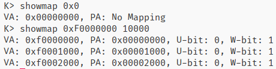
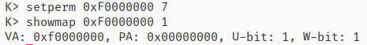
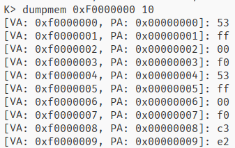

# JOS Lab2 Report

陈仁泽 1700012774

[TOC]

## Exercise 1

### `boot_alloc`

直接返回nextfree，并将nextfree增加alloc的空间（对齐后）即可。

```c
result = nextfree;
if (n > 0) 
    nextfree = (char*)ROUNDUP((uint32_t)nextfree + n, PGSIZE);
return result;
```


### `mem_init`

使用boot_alloc申请空间，并初始化为0。

```C
pages = (struct PageInfo *) boot_alloc(npages * sizeof(struct PageInfo));
memset(pages, 0, npages * sizeof(struct PageInfo));
```


### `page_init`

先定义两个工具宏，用于设置第_i号页是否为可分配页

```C
#define MARK_FREE(_i) do {\
    pages[_i].pp_ref = 0;\
    pages[_i].pp_link = page_free_list;\
	page_free_list = &pages[_i];\
} while(0)
#define MARK_USE(_i) do {\
    pages[_i].pp_ref = 0;\
    pages[_i].pp_link = NULL;\
} while(0)
```

提前声明一些变量，并进行一些初始化。其中bss_end为kernel的.bss段的尾部，boot_alloc_end为之前使用boot_alloc分配空间的尾部。

```C
extern char end[];
physaddr_t bss_end;
physaddr_t boot_alloc_end;
size_t i;

page_free_list = NULL;
bss_end = PADDR(ROUNDUP((char*)end, PGSIZE));
boot_alloc_end = PADDR(boot_alloc(0));
```

第零页不可分配：

```C
MARK_USE(0);
```

第一到第npages_basemem页可分配：

```C
for (i = 1; i < npages_basemem; ++i)
    MARK_FREE(i);
```

[IOPHYSMEM, EXTPHYSMEM)不可分配：

```C
for (i = IOPHYSMEM / PGSIZE; i < EXTPHYSMEM / PGSIZE; ++i)
    MARK_USE(i);
```

[EXTPHYSMEM, boot_alloc_end)不可分配：

```C
for (i = EXTPHYSMEM / PGSIZE; i < bss_end / PGSIZE; ++i)
    MARK_USE(i);
for (i = bss_end / PGSIZE; i < boot_alloc_end / PGSIZE; ++i)
    MARK_USE(i);
```

剩下的可分配：

```C
for (i = boot_alloc_end / PGSIZE; i < npages; ++i)
    MARK_FREE(i);
```


### `page_alloc`

分配过程比较简单。需要注意的是pp_ref要初始化为0，以及使用page2kva将PageInfo转化为虚拟地址。

```C
struct PageInfo *
page_alloc(int alloc_flags)
{
	// Fill this function in
    struct PageInfo *pp;

    if (!page_free_list)
        return NULL;

    pp = page_free_list;
    page_free_list = pp->pp_link;
    pp->pp_link = NULL;
    pp->pp_ref = 0; // Not increment reference count

    if (alloc_flags & ALLOC_ZERO)
        memset(page2kva(pp), 0, PGSIZE);

    return pp;
}
```


### `page_free`

这个比较简单，没什么要注意的点。

```C
void
page_free(struct PageInfo *pp)
{
	// Fill this function in
	// Hint: You may want to panic if pp->pp_ref is nonzero or
	// pp->pp_link is not NULL.
    if(pp->pp_ref != 0 || pp->pp_link != NULL)
        panic("page_free");
    pp->pp_link = page_free_list;
    page_free_list = pp;
}
```


## Exercise 2

## Exercise 3

> Q1: Assuming that the following JOS kernel code is correct, what type should variable x have, uintptr_t or physaddr_t?

```C
mystery_t x;
char* value = return_a_pointer();
*value = 10;
x = (mystery_t) value;
```


因为value为指针类型，是虚拟地址，因此x的类型应为`uintptr_t`


## Exercise 4

### `pagedir_walk`

严格按照函数的描述实现即可。个人认为比较需要注意的点是，可以将页目录项的所有功能位置位，因为检查主要以页表项的功能位为准，所以页目录项的最好设置得宽松一些。

```C
pte_t *
pgdir_walk(pde_t *pgdir, const void *va, int create)
{
	// Fill this function in
    pde_t *pde;
    pte_t *pgtab;
    struct PageInfo *pp;

    pde = &pgdir[PDX(va)];
    if (!(*pde & PTE_P)) {
        if (!create || !(pp = page_alloc(ALLOC_ZERO)))
            return NULL;
        *pde = page2pa(pp) | 0xFFF; // it's OK to set all bits in pde.
        pp->pp_ref += 1;
    }

    pgtab = KADDR(PTE_ADDR(*pde));
    return &pgtab[PTX(va)];
}
```


### `boot_map_region`

虽然函数描述说va和pa会对齐到页，但还是检查一下比较好。其他方面比较简单。

```C
static void
boot_map_region(pde_t *pgdir, uintptr_t va, size_t size, physaddr_t pa, int perm)
{
	// Fill this function in
    size_t off;
    pte_t *pte;

	if ((va & (PGSIZE - 1)) || (pa & (PGSIZE - 1)))
		panic("boot_map_region");
    
    for (off = 0; off < size; off += PGSIZE) {
        if (!(pte = pgdir_walk(pgdir, (void*)(va + off), 1)))
            panic("boot_map_region");
        *pte = (pa + off) | perm | PTE_P;
    }
}
```


### `page_lookup`

严格按照功能描述实现即可

```C
struct PageInfo *
page_lookup(pde_t *pgdir, void *va, pte_t **pte_store)
{
	// Fill this function in
    pte_t *pte;

    pte = pgdir_walk(pgdir, va, 0);
    if (!pte || !(*pte & PTE_P))
        return NULL;

    if (pte_store)
        *pte_store = pte;
    return pa2page(PTE_ADDR(*pte));
}
```


### `page_remove`

page_decref会负责物理页的释放。而在清空页表项之前，需要禁用TLB。

```C
void
page_remove(pde_t *pgdir, void *va)
{
	// Fill this function in
    pte_t *pte;
    struct PageInfo *pp;

    if (!(pp = page_lookup(pgdir, va, &pte)))
        return;
    page_decref(pp);
    tlb_invalidate(pgdir, va);
    memset(pte, 0, sizeof(pte_t));
}
```


### `page_insert`

先将pp_ref递增，然后再尝试移除va处的映射，这样可以避免re-inserted造成的一些错误。值得注意的是，page_remove会调用page_lookup，而page_lookup也会调用pgdir_walk，这就造成了pgdir_walk的重复调用。不过从代码的简洁性和复用性方面考虑，还是这样比较好。

```C
int
page_insert(pde_t *pgdir, struct PageInfo *pp, void *va, int perm)
{
	// Fill this function in
    pte_t *pte;
    if (!(pte = pgdir_walk(pgdir, va, 1)))
        return -E_NO_MEM;
    pp->pp_ref++;
    page_remove(pgdir, va);
    *pte = page2pa(pp) | perm | PTE_P;
    return 0;
}
```


## Exercise 5

page_map_region会默认置位页表项的PTE_P，因此将perm设为PTE_U即可。

关于page自身的映射，会在之后映射整个内核空间时进行。

```C
//////////////////////////////////////////////////////////////////////
// Map 'pages' read-only by the user at linear address UPAGES
// Permissions:
//    - the new image at UPAGES -- kernel R, user R
//      (ie. perm = PTE_U | PTE_P)
//    - pages itself -- kernel RW, user NONE
// Your code goes here:
boot_map_region(kern_pgdir, UPAGES, PTSIZE, PADDR(pages), PTE_U);
```


guard page不进行映射。主要是不清楚要映射到那个那个物理空间，因为理论上guard page甚至连读都不应读。

```C
//////////////////////////////////////////////////////////////////////
// Use the physical memory that 'bootstack' refers to as the kernel
// stack.  The kernel stack grows down from virtual address KSTACKTOP.
// We consider the entire range from [KSTACKTOP-PTSIZE, KSTACKTOP)
// to be the kernel stack, but break this into two pieces:
//     * [KSTACKTOP-KSTKSIZE, KSTACKTOP) -- backed by physical memory
//     * [KSTACKTOP-PTSIZE, KSTACKTOP-KSTKSIZE) -- not backed; so if
//       the kernel overflows its stack, it will fault rather than
//       overwrite memory.  Known as a "guard page".
//     Permissions: kernel RW, user NONE
// Your code goes here:
boot_map_region(
    kern_pgdir, KSTACKTOP - KSTKSIZE, KSTKSIZE, 
    PADDR(bootstacktop) - KSTKSIZE, PTE_W);
```


这个比较简单。

```C
//////////////////////////////////////////////////////////////////////
// Map all of physical memory at KERNBASE.
// Ie.  the VA range [KERNBASE, 2^32) should map to
//      the PA range [0, 2^32 - KERNBASE)
// We might not have 2^32 - KERNBASE bytes of physical memory, but
// we just set up the mapping anyway.
// Permissions: kernel RW, user NONE
// Your code goes here:
boot_map_region(kern_pgdir, KERNBASE, ~(uint32_t)0 - KERNBASE + 1, 0, PTE_W);
```


> Q2: What entries (rows) in the page directory have been filled in at this point? What addresses do they map and where do they point? In other words, fill out this table as much as possible:

| Entry | Base Virtual Address | Points to (logically)                           |
| ----- | -------------------- | ----------------------------------------------- |
| 1023  | 0xFFC00000           | Page table for top 4MB of phys memory           |
| 1022  | 0xFF800000           | Page table for top 8MB ~ top 4MB of phys memory |
| ...   | ...                  | ...                                             |
| 960   | 0xF0000000           | Page table for bottom 4MB of phys memory        |
| 959   | 0xEFC00000           | Page table that contains kernel stack           |
| ...   | ...                  | ...                                             |
| 957   | 0xEF400000           | Page directory                                  |
| 956   | 0xEF000000           | Page table mapping `pages` to user space        |
| ...   | ...                  | ...                                             |
| 1     | 0x00400000           |                                                 |
| 0     | 0x00000000           |                                                 |


> Q3: We have placed the kernel and user environment in the same address space. Why will user programs not be able to read or write the kernel's memory? What specific mechanisms protect the kernel memory?

因为用户空间和内核空间的页表项中的PTE_U位不同。本质上是x86处理器的MMU通过CS寄存器的特权级结合页表项的PTE_U位来判断当前代码是否有访问特定地址的权限。


> Q4: What is the maximum amount of physical memory that this operating system can support? Why?

可利用的最大物理内存大小为128MB（一共32768 = 2^15页）。因为硬件检测出的物理内存就是这么大（可通过qemu的运行参数设置）。


> Q5: How much space overhead is there for managing memory, if we actually had the maximum amount of physical memory? How is this overhead broken down?

内存管理部分包括1024个虚拟页表和1个物理页表（不考虑空闲物理页链表头），其中所有虚拟页表所占内存为1024*4KB = 4MB，物理页表所占内存为32768 * 8B = 256KB = 0.25MB （每个表项大小为8B），总内存开销为4.25MB。因为采用了分级页表机制，实际上平时只有很少一部分的虚拟页表会位于内存中，所以总开销一般不足1MB。


> Q6: Revisit the page table setup in kern/entry.S and kern/entrypgdir.c. Immediately after we turn on paging, EIP is still a low number (a little over 1MB). At what point do we transition to running at an EIP above KERNBASE? What makes it possible for us to continue executing at a low EIP between when we enable paging and when we begin running at an EIP above KERNBASE? Why is this transition necessary?

在下列指令后EIP进入高地址：

```
mov	$relocated, %eax
jmp	*%eax
```

因为entry_pgdir将[0, 4MB)和[KERNBASE, KERNBASE + 4MB)的虚拟地址都映射到了[0, 4MB)的物理地址上，因此刚开启分页模式后，EIP虽然仍位于低地址，但依然可以正常运行。因为开启分页前后，EIP的值没变（严格来说前进了一个指令），但对其的解释却变了，对内存的访问模式从物理访存转换到了虚拟访存，因此为了兼容前后的情况，entry_pgdir的映射必须包含一个[0, 4MB)上的恒等映射（4MB不是必须的，只是因为一个页目录项正好囊括4MB的内存）

```C
__attribute__((__aligned__(PGSIZE)))
pde_t entry_pgdir[NPDENTRIES] = {
	// Map VA's [0, 4MB) to PA's [0, 4MB)
	[0]
		= ((uintptr_t)entry_pgtable - KERNBASE) + PTE_P,
	// Map VA's [KERNBASE, KERNBASE+4MB) to PA's [0, 4MB)
	[KERNBASE>>PDXSHIFT]
		= ((uintptr_t)entry_pgtable - KERNBASE) + PTE_P + PTE_W
};
```


## This completes the lab

```
running JOS: (1.8s) 
  Physical page allocator: OK 
  Page management: OK 
  Kernel page directory: OK 
  Page management 2: OK 
Score: 70/70
```


## Challenge: JOS kernel monitor extension

### `showmap`

简单地遍历页表即可。

```C
int 
mon_showmap(int argc, char **argv, struct Trapframe *tf) 
{
    static const char *msg = 
    "Usage: showmappings <start> [<length>]\n";

    if (argc < 2)
        goto help;

    uintptr_t vstart, vend;
    size_t vlen;
    pte_t *pte;

    vstart = (uintptr_t)strtol(argv[1], 0, 0);
    vlen = argc >= 3 ? (size_t)strtol(argv[2], 0, 0) : 1;
    vend = vstart + vlen;

    vstart = ROUNDDOWN(vstart, PGSIZE);
    vend = ROUNDDOWN(vend, PGSIZE);

    for(; vstart <= vend; vstart += PGSIZE) {
        pte = pgdir_walk(kern_pgdir, (void*)vstart, 0);
        if (pte && *pte & PTE_P) {
            cprintf("VA: 0x%08x, PA: 0x%08x, U-bit: %d, W-bit: %d\n",
            vstart, PTE_ADDR(*pte), !!(*pte & PTE_U), !!(*pte & PTE_W));
        } else {
            cprintf("VA: 0x%08x, PA: No Mapping\n", vstart);
        }
    }
    return 0;

help: 
    cprintf(msg);
    return 0;
}
```

效果：



### `setperm`

也是简单地遍历即可。

```C
int 
mon_setperm(int argc, char **argv, struct Trapframe *tf) 
{
    static const char *msg = 
    "Usage: setperm <virtual address> <permission>\n";

    if (argc != 3)
        goto help;
    
    uintptr_t va;
    uint16_t perm;
    pte_t *pte;

    va = (uintptr_t)strtol(argv[1], 0, 0);
    perm = (uint16_t)strtol(argv[2], 0, 0);

    pte = pgdir_walk(kern_pgdir, (void*)va, 0);
    if (pte && *pte & PTE_P) {
        *pte = (*pte & ~0xFFF) | (perm & 0xFFF) | PTE_P;
    } else {
        cprintf("There's no such mapping\n");
    }
    return 0;

help: 
    cprintf(msg);
    return 0;    
}
```

效果：




### `dumpmem`

处理命令行参数稍微有点繁琐，其他还行。之后可以考虑添加个类似linux getopt的函数。

关于查看物理地址的问题，因为JOS的默认内存是128MB，而KERNBASE以上的虚拟内存大小为256MB，因此可以直接通过访问对应的KERNBASE以上的虚拟地址来访问对应的物理地址。

如果自定义Qemu提供的内存大小，导致访问的物理地址大于256MB的话，可以临时映射一个页（比如映射0x0所处的页）到对应的物理地址，来查看其内容。

默认物理内存不超过32位，不然其中的`uint32_t`需要改成`uint64_t`。

```C

static void 
dump_vm(uint32_t mstart, uint32_t mend)
{
    uint32_t next;
    pte_t *pte;
    while (mstart < mend) {
        if (!(pte = pgdir_walk(kern_pgdir, (void *)mstart, 0))) {
            next = MIN((uint32_t)PGADDR(PDX(mstart) + 1, 0, 0), mend);
            for (; mstart < next; ++mstart)
                cprintf("[VA: 0x%08x, PA: No mapping]: None\n", mstart);
        } else if (!(*pte & PTE_P)) {
            next = MIN((uint32_t)PGADDR(PDX(mstart), PTX(mstart) + 1, 0), mend);
            for (; mstart < next; ++mstart)
                cprintf("[VA: 0x%08x, PA: No mapping]: None\n", mstart);
        } else {
            next = MIN((uint32_t)PGADDR(PDX(mstart), PTX(mstart) + 1, 0), mend);
            for (; mstart < next; ++mstart)
                cprintf("[VA: 0x%08x, PA: 0x%08x]: %02x\n", mstart,
                        PTE_ADDR(*pte) | PGOFF(mstart), *(uint8_t *)mstart);
        }
    }
}

static void 
dump_pm(uint32_t mstart, uint32_t mend)
{
    static const uint32_t map_base = 0;
    uint32_t next, base;

    while(mstart < mend) {
        next = MIN(ROUNDUP(mstart + 1, PGSIZE), mend);
        base = ROUNDDOWN(mstart, PGSIZE);
        page_insert(kern_pgdir, &pages[base / PGSIZE], (void*)map_base, PTE_P);
        for (; mstart < next; ++mstart)
            cprintf("[PA: 0x%08x]: %02x\n", mstart, *((uint8_t*)(mstart - base + map_base)));
    }
    page_remove(kern_pgdir, (void*)map_base);
}

int 
mon_dumpmem(int argc, char **argv, struct Trapframe *tf) 
{
    static const char *msg =
    "Usage: dumpmem [option] <start> <length>\n"
    "\t-p, --physical\tuse physical address\n";

    int phys = 0;

    if (argc == 4) {
        int i;
        for (i = 1; i < argc; ++i) {
            if (!strcmp(argv[i], "-p") || !strcmp(argv[i], "--physical")) {
                phys = 1;
                break;
            }
        }
        if (!phys)
            goto help;
        for (int j = i; j < argc - 1; ++j)
            argv[j] = argv[j + 1];
    } else if (argc != 3) {
        goto help;
    }

    uint32_t mstart, mend;
    size_t mlen;
    
    mstart = (uint32_t)strtol(argv[1], 0, 0);
    mlen = (size_t)strtol(argv[2], 0, 0);
    mend = mstart + mlen;

    if (phys) {
        if (mend > npages * PGSIZE) {
            cprintf("Target memory out of range\n");
            return 0;
        }
        if (mend > ~(uint32_t)0 - KERNBASE + 1) {
            dump_pm(mstart, mend);
        } else {
            for (; mstart < mend; ++mstart) {
                cprintf("[PA: 0x%08x]: %02x\n", mstart,
                        *(uint8_t *)KADDR(mstart));
            }
        }
    } else {
        dump_vm(mstart, mend);
    }
    return 0;

help: 
    cprintf(msg);
    return 0;
}
```

效果：



